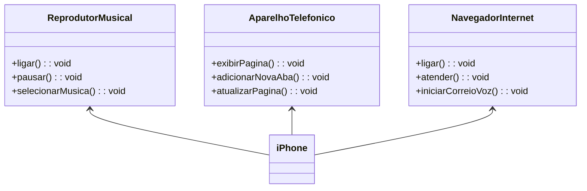

# Desafio-UML
# [DIO](www.dio.me) - Trilha Java Básico

## Autores
- [Luiz_Oliveira](https://github.com/LuizzOliveira)

## POO - Desafio

### Modelagem e Diagramação de um Componente iPhone

Modelar e diagramar a representação UML do componente iPhone, abrangendo suas funcionalidades como Reprodutor Musical, Aparelho Telefônico e Navegador na Internet.


#### Funcionalidades a Modelar
1. **Reprodutor Musical**
	@@ -24,41 +19,40 @@ Com base no vídeo de lançamento do iPhone de 2007 (link abaixo), você deve el
   - Métodos: `exibirPagina(String url)`, `adicionarNovaAba()`, `atualizarPagina()`

### Objetivo
 Criar um diagrama UML que represente as funcionalidades descritas acima.

###Diagrama UML (Mermaid)


```bash
https://github.com/LuizzOliveira/trilha-java-basico/desafios/poo/README.md
```` 
